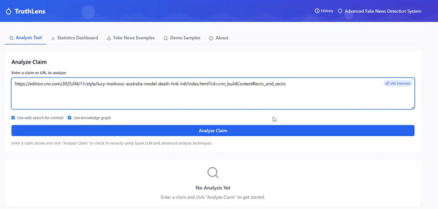
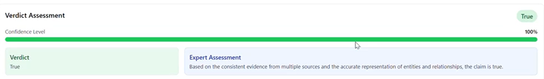
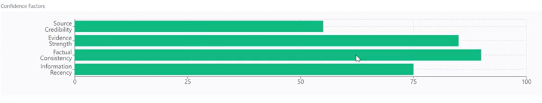
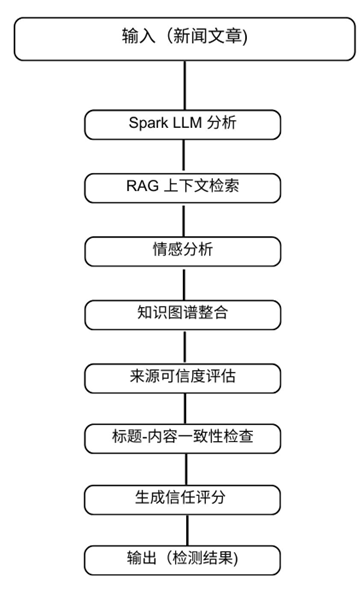
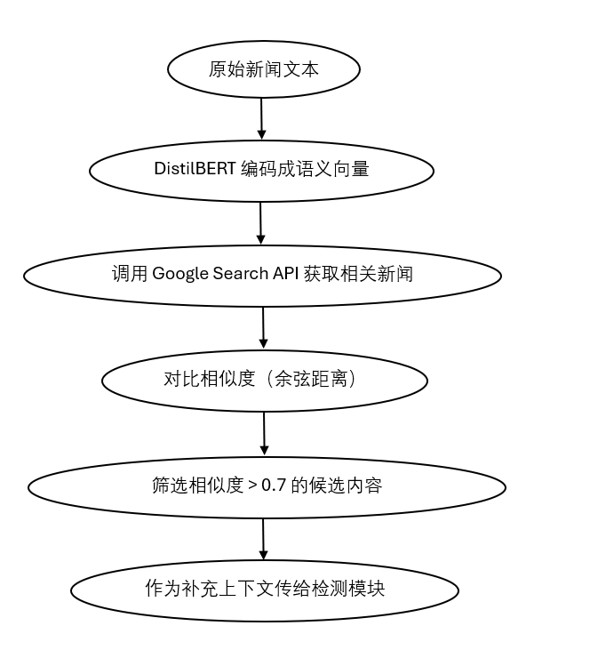

# TruthLens — SparkLLM-Based Fake News Detection Framework

<p align="center"><b>An AI system that fact-checks claims and news articles using RAG + LLM reasoning, NLP-based manipulation analysis, and source credibility scoring.</b></p>

<p align="center">
  
</p>

<p align="center">
  
  
  
  
  
</p>

## 🏆 Why this project

**TruthLens won 2nd Prize in the "青智未来" New Quality Productivity track of the Challenge Cup** ("挑战杯" — one of China's largest student innovation competitions), judged against national university teams, for building a working fact-checking system that goes beyond a single "true/false" classifier: it retrieves live web evidence, reasons over it with an LLM, and separately scores the *manipulation tactics* and *source credibility* around a claim.

Misinformation spreads roughly **6x faster than real news** and costs the global economy an estimated **$78B/year** (cited in the team's proposal as MIT Sloan Management Review, 2023) — that gap between detection speed and spread speed is the problem TruthLens targets.

**Team & my contribution:** built by a 7-person sophomore CS team across a ~25-day sprint (data collection → core RAG/LLM pipeline → frontend → cloud deployment). My part was **system design and architecture of the multi-stage detection pipeline, retrieval/model research, technical documentation, and the competition presentation.**

*Reported in the competition submission: ~92% detection accuracy and <2s response time in AWS testing. These reflect the judged proposal rather than a benchmark reproducible from this trimmed public repo — see [Architecture Deep Dive](#-architecture-deep-dive) for what's actually implemented in the open-sourced code.*

### Screenshots

| Main analysis screen | Verdict + confidence | Confidence breakdown |
|---|---|---|
|  |  |  |

## 📑 Table of Contents

- [Overview](#-overview)
- [How It Works](#-how-it-works)
- [Features](#-features)
- [Tech Stack](#-tech-stack)
- [Architecture Deep Dive](#-architecture-deep-dive)
- [Getting Started](#-getting-started)
- [Configuration](#️-configuration)
- [Usage](#-usage)
- [API Documentation](#-api-documentation)
- [Frontend Components](#️-frontend-components)
- [Performance & Security Notes](#-performance--security-notes)
- [Roadmap](#-roadmap)
- [Team & Status](#-team--status)
- [License](#-license)

## 🌟 Overview

TruthLens takes a free-text claim or a news article URL and produces a fact-check verdict backed by retrieved evidence, plus a set of independent risk signals that a single classifier wouldn't surface:

1. **Evidence-based verification** — retrieves and reasons over live web results rather than relying on the LLM's parametric memory alone
2. **Multi-dimensional trust assessment** — separately scores content, source, and emotional/rhetorical framing
3. **Transparent reasoning** — every verdict ships with the evidence and chain-of-thought behind it, not just a label
4. **Accessible UI** — a full React dashboard translates the pipeline's output into something a non-technical reader can act on

## 🔍 How It Works



<details>
<summary>Text version</summary>

```
 Claim or URL
      │
      ▼
 URL Handler ──► extracts article text + metadata (author, date, domain)
      │
      ▼
 Web Search Engine ──► Google Search API pulls candidate evidence
      │
      ▼
 Embedding Engine ──► Sentence-Transformer embeddings + cosine similarity
      │
      ▼
 FAISS Indexer ──► nearest-neighbor search over evidence embeddings
      │
      ▼
 Spark LLM Fact-Checker ──► RAG-grounded, chain-of-thought verdict
      │             (two-pass verification + fine-tuned BERT-family model
      │              for calibrated True / False / Partially True scoring)
      ▼
 Parallel signal layer:
   • Entity Extractor (spaCy NER)      • Sentiment / Propaganda Analyzer (VADER)
   • Credibility Analyzer (source rep) • AI Content Detector
   • Title–Content Contradiction Check • Knowledge Graph cross-referencing
      │
      ▼
 Composite "Trust Lens" score + full explanation ──► React dashboard
```

</details>

## ✨ Features

### Core Analysis
- **Claim & URL analysis** — free-text claims or full articles, with site-specific extraction for major outlets (CNN, BBC, NYTimes, etc.)
- **RAG-enhanced fact-checking** — Google Search retrieval → semantic re-ranking → FAISS similarity search → Spark LLM reasoning
- **Multi-pass verification** — a second verification pass recalibrates confidence and reduces hallucinated verdicts, including nuanced "Partially True" outcomes
- **Named entity recognition** — extracts and cross-references PERSON/ORG/GPE/DATE/PERCENT/MONEY entities between claim and evidence

<details>
<summary><b>Content risk analysis</b> — emotional manipulation, propaganda, AI-generated text, credibility, headline mismatch</summary>

- **Emotional manipulation detection** — VADER sentiment + emotional-keyword density + sentence-level polarity distribution
- **Propaganda technique detection** — pattern-based detection of 8 techniques: name calling, bandwagon, fear mongering, appeal to authority, false dilemma, straw man, ad hominem, whataboutism
- **AI-generated content detection** — linguistic pattern, structural, and LLM-assessment signals (transition-phrase overuse, paragraph-length variance, pronoun/contraction usage)
- **Source credibility scoring** — domain reputation database, author credibility, publication recency, composite "Trust Lens" score
- **Title–content contradiction analysis** — flags headlines that misrepresent the article body, with a severity scale

</details>

<details>
<summary><b>Dashboard & UX</b> — trend visualization, confidence gauges, PDF export</summary>

- Interactive dashboard with monthly fake-news trend and category breakdowns
- Color-coded verdict badges, animated confidence gauges, and a 3D trust badge (Three.js)
- Prompt-quality assistant that suggests better-formed claims before you submit
- PDF report export, shareable results, and local analysis history

</details>

## 🔧 Tech Stack

| Layer | Technology |
|---|---|
| **LLM reasoning** | Spark LLM (`4.0Ultra`), structured chain-of-thought prompting, multi-pass verification |
| **Retrieval** | Google Search API, Sentence-Transformers (`distilbert-base-nli-mean-tokens`), FAISS |
| **NLP** | spaCy (NER), NLTK + VADER (sentiment), Hugging Face Transformers, fine-tuned BERT-family classifier |
| **Backend** | Python 3.8+, FastAPI, Pydantic |
| **Scraping** | Requests, BeautifulSoup4, Trafilatura |
| **Frontend** | React 19, Tailwind CSS, Recharts, Three.js, Lucide icons, jsPDF |
| **Optional** | Neo4j (knowledge-graph cross-referencing) |

## 🏗 Architecture Deep Dive



<details>
<summary>All 12 backend components (click to expand)</summary>

All components live in [`Try_train.py`](Try_train.py), organized as a pipeline of single-responsibility classes:

| # | Class | Responsibility |
|---|---|---|
| 1 | `WebSearchEngine` | Google Search API retrieval, caching, fallback extraction |
| 2 | `URLHandler` | Article extraction + metadata parsing, per-site handling |
| 3 | `EmbeddingEngine` | Sentence-Transformer embeddings, similarity filtering |
| 4 | `FAISSIndexer` | Vector index build + nearest-neighbor search |
| 5 | `EntityExtractor` | spaCy-based NER and entity cross-referencing |
| 6 | `KnowledgeGraph` | Entity relationship cross-referencing |
| 7 | `SparkLLMFactChecker` | Core RAG fact-checking, multi-pass verification, confidence calibration |
| 8 | `SentimentAnalyzer` | VADER sentiment, emotional-keyword density, propaganda detection |
| 9 | `CredibilityAnalyzer` | Domain/author credibility, Trust Lens composite score |
| 10 | `AIContentDetector` | Multi-signal AI-generated-text detection |
| 11 | `PromptQualityAnalyzer` | Claim-quality scoring and rewrite suggestions |
| 12 | `FakeNewsDetectionSystem` | Orchestrates the full pipeline end-to-end |

</details>

## 📦 Getting Started

### Prerequisites
- Python 3.8+ and pip
- Node.js 14+ and npm
- Google Search API key + Custom Search Engine ID
- Spark LLM API credentials
- Optional: Neo4j (for knowledge-graph features)

### Setup

```bash
git clone https://github.com/naiy26/Fake-News-Detection.git
cd Fake-News-Detection

# Backend
python -m venv venv
source venv/bin/activate       # Windows: venv\Scripts\activate
pip install -r requirements.txt
python -m nltk.downloader punkt vader_lexicon
python -m spacy download en_core_web_sm

# Frontend (same repo root)
npm install
```

Create a `.env` file in the repo root:

```
GOOGLE_API_KEY=your_google_api_key
GOOGLE_CX=your_custom_search_engine_id
SPARK_API_PASSWORD=your_spark_api_password

# Optional
NEO4J_URI=bolt://localhost:7687
NEO4J_USER=neo4j
NEO4J_PASSWORD=password
```

## ⚙️ Configuration

Key tunables in [`Try_train.py`](Try_train.py):

| Setting | Default | Where |
|---|---|---|
| Embedding model | `distilbert-base-nli-mean-tokens` | `EmbeddingEngine` |
| Similarity threshold | `0.70` | `filter_by_threshold` |
| spaCy model | `en_core_web_sm` | `EntityExtractor` |
| Spark LLM model | `4.0Ultra` | `SparkLLMFactChecker` |
| Domain credibility list | — | `credible_news_domains` |

## 🚀 Usage

**CLI:**
```bash
python Try_train.py --claim "COVID-19 vaccines contain microchips for tracking people."
python Try_train.py --claim "https://example.com/article"
python Try_train.py --claim "Your claim here" --no-rag --no-kg
python Try_train.py --api --host 0.0.0.0 --port 8000
```

**Web app:**
```bash
npm start   # http://localhost:3000, expects the API running on :8000
```
Enter a claim or URL, toggle web-search/knowledge-graph options, and click **Analyze Claim** to see the verdict, evidence, and risk breakdown.

## 📘 API Documentation

<details>
<summary><code>POST /analyze</code> — analyze a claim or URL</summary>

Request:
```json
{
  "claim": "string (required) - claim text or URL",
  "use_rag": "boolean (default: true)",
  "use_kg": "boolean (default: true)",
  "is_url": "boolean (optional)"
}
```

Response (abridged):
```json
{
  "verdict": "True | False | Partially True | Unverified",
  "confidence": "integer percentage",
  "explanation": "string",
  "reasoning": "string",
  "entities": "object",
  "emotional_manipulation": { "score": "float", "level": "LOW|MODERATE|HIGH" },
  "ai_detection": { "ai_score": "float", "ai_verdict": "string" },
  "credibility_assessment": "object",
  "title_content_contradiction": "object",
  "trust_lens_score": "float",
  "processing_time": "float"
}
```
</details>

<details>
<summary><code>POST /analyze-prompt</code> — get suggestions for a weak claim/prompt</summary>

Request: `{ "prompt": "string" }`

Response: `{ "is_good_prompt": bool, "quality_score": float, "suggestions": [...], "improved_prompt": "string" }`
</details>

<details>
<summary><code>GET /health</code> — health check</summary>

Response: `{ "status": "healthy", "version": "string", "timestamp": "string" }`
</details>

## 🖥️ Frontend Components

The UI is a single React app ([`src/App.js`](src/App.js)) built around these pieces:

| Component | Purpose |
|---|---|
| `CredibilityHeatmap` | Interactive source-credibility heatmap |
| `InteractiveAIDetectionBadge` | Expandable AI-content-detection panel |
| `EnhancedVerdictAssessment` | Verdict + confidence visualization |
| `EmotionalAnalysisChart` | Manipulation/emotion charting |
| `TrustBadge3D` | Three.js 3D trust-score badge |
| `PromptSuggestionPanel` | Real-time claim-quality suggestions |

## 🚄 Performance & Security Notes

- Result caching, debounced input, and background tasks keep the API responsive
- FAISS keeps evidence retrieval fast even as the candidate set grows
- Every fallback path (search failure, extraction failure, LLM timeout) degrades gracefully rather than erroring out
- Inputs are validated via Pydantic; CORS is explicitly configured
- ⚠️ Known gaps if you extend this project: no automated test suite yet, and no rate limiting on the public endpoints — both are natural next steps

## 🔮 Roadmap

- Multilingual claim support and domain-specific models (politics/health/science)
- Multimodal (image/video) verification and citation-level checking
- Persistent vector store to replace in-memory FAISS
- Browser extension for one-click analysis on any page

## 👥 Team & Status

Built by a student team for the **Challenge Cup Competition**, where it placed **2nd**. This repo reflects the version submitted for judging; it's shared here as a portfolio/reference project rather than an actively maintained product. Feel free to open an issue if you have questions about the approach.

## 📄 License

No license file is currently included — all rights reserved by default. Open an issue if you'd like to discuss reuse.

<p align="center">Built to make fact-checking evidence-based, not vibes-based.</p>
